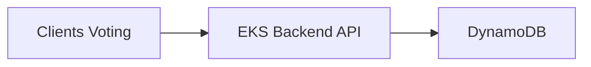

# High-Scale AWS Database & Compute Tradeoffs
### **DynamoDB vs Aurora vs PostgreSQL with EKS, Fargate, EC2**
### **Including Multi-Region Design, Immutability, and Architecture for a 350M-User Global Voting System**

---

# **1. Overview**
This README provides a complete engineering-oriented comparison between **AWS DynamoDB**, **Amazon Aurora**, and **PostgreSQL**, including:

- Architectural differences
- Data modeling examples
- Multi-region replication strategies
- Real-world benchmark comparisons
- Recommendation for a **350M+ user global voting system**
- Deployment architecture using **Amazon EKS**, **Fargate**, and **EC2**
- Pros & cons of the compute environments

A decision tree is included to assist engineering teams in selecting the best database for different workloads.

---

# **2. Decision Tree: How to Choose DynamoDB vs Aurora vs PostgreSQL**
```mermaid
flowchart TD
    A[Start: What type of workload?] --> B{Is workload<br>transactional (OLTP)?}
    B -->|No (Analytics, Aggregations)| C[Use PostgreSQL or Athena/Redshift]
    B -->|Yes| D{Is scale > 50k req/sec?}

    D -->|Yes| E[DynamoDB]
    D -->|No| F{Need strong SQL + joins?}

    F -->|Yes| G[Aurora PostgreSQL/MySQL]
    F -->|No| H{Need relational & transactions?}

    H -->|No| I[DynamoDB]
    H -->|Yes| J[Aurora]

    E --> K{Need global multi-region active/active?}
    K -->|Yes| L[DynamoDB Global Tables]
    K -->|No| M[DynamoDB Standard]

    G --> N{Global writes required?}
    N -->|Yes| O[Aurora Global Database]
    N -->|No| P[Aurora Standard]

    I --> Q[End]
    L --> Q
    P --> Q
```

---

# **3. Database Technology Deep Dive**
## **3.1 DynamoDB**
- **Model:** Key-Value + Document Store
- **Storage Engine:** SSD-backed partitioned LSM-trees
- **Scaling:** Automatic horizontal scaling with partition management
- **Indexing:** Primary Key, Sort Key, GSIs, LSIs ( Global Secondary Indexes (GSIs) and Local Secondary Indexes (LSIs))
- **Data Example:**
```json
{
  "PK": "VOTE#123456",
  "SK": "USER#998877",
  "candidateId": "4567",
  "timestamp": 1732655598
}
```
### **Global Availability**
- Fully managed global replication
- Multi-region active/active (<100ms replication)

### **Immutability**
- Append-only design using versioned Sort Keys
- DynamoDB Streams for audit logging
- Zero overwrites = auditable change history

---

## **3.2 Aurora (PostgreSQL/MySQL)**
- **Model:** Fully relational SQL
- **Storage Engine:** Distributed log-structured 6-way replicated backend
- **Compute Model:** Writer + up to 15 read replicas
- **Data Example:**
```sql
CREATE TABLE votes (
  user_id BIGINT,
  vote_id BIGINT,
  candidate_id BIGINT,
  created_at TIMESTAMP,
  PRIMARY KEY (vote_id)
);
```

### **Global Availability**
- **Aurora Global Database**
- Secondary regions are **read-only**
- Writes allowed **only on primary**


---

## **3.3 PostgreSQL (Self-managed)**
- **Model:** Relational SQL with advanced features
- Rich indexing types 
- Runs on EC2 or EKS

### **Global Availability**
- Requires external tool
- No native multi-region active/active

### **Immutability**
- Append-only tables (versioning)


---

# **4. Benchmark Performance Examples**
| Metric | DynamoDB | Aurora | PostgreSQL (Self-managed) |
|--------|-----------|---------|----------------------------|
| Single-partition write | 100k+ req/sec | ~20k writes/sec | ~5–10k writes/sec |
| Latency (p50) | <4 ms | 2–10 ms | 5–15 ms |
| Multi-region replication | <100 ms | 1–3 sec | 1–10 sec |
| Horizontal scaling | Automatic | Limited | Manual |
| Peak throughput | Virtually unlimited | Medium-high | Low-medium |

---

# **5. Multi-Region Availability Comparison**
| Feature | DynamoDB | Aurora | PostgreSQL |
|---------|-----------|---------|------------|
| Multi-region writes | **Yes** | No | No |
| Multi-region reads | Yes | Yes | Yes (manual) |
| Failover time | <1s | 10–30s | 60s+ |
| Conflict resolution | Automatic | N/A | Manual & complex |

---

# **6. Immutability Approaches**
## **6.1 DynamoDB**
- Append-only PK/SK versioning
- Streams → immutable audit trail
- Optional TTL cleanup

## **6.2 Aurora / PostgreSQL**
- Temporal (append-only) tables
- Triggers writing changes into audit tables
- WAL archiving for forensic analysis (Write-Ahead Log)


---

# **7. High-Scale Voting System (350M Users, 250k–500k Votes/sec)**
## **Why DynamoDB is the best choice**
| Requirement | Best Choice | Reason |
|------------|-------------|--------|
| 350M simultaneous users | **DynamoDB** | Predictable linear scaling |
| Global multi-region | **Global Tables** | Active/active, sub-100ms replication |
| Zero vote loss | DynamoDB Streams | Durable capture of all events |
| Immutability | Versioned writes | Full audit trail |


---

# **8. Architecture with EKS + Fargate + DynamoDB**


---

# **9. Compute Environment Comparison (EKS, Fargate, EC2)**
## **9.1 Amazon EKS**
### Pros
- Fully compatible with Kubernetes ecosystem
- Managed nodegroups reduce ops overhead
- Autoscaling, GPU/ARM support
### Cons
- Higher complexity
- Requires Kubernetes expertise

---

## **9.2 AWS Fargate**
### Pros
- No servers to manage
- High isolation (per-pod microVM)
- Scales automatically
- Best for spiky or unpredictable workloads
### Cons
- More expensive than EC2
- Limits on custom networking/kernel tuning
- No daemonsets

---

## **9.3 EC2 (with or without EKS)**
### Pros
- Cheapest at scale, especially with Spot instances
- Full control over OS, kernel, and runtime
- Best for tuned high-throughput workloads
### Cons
- Must patch, secure, and maintain servers
- Slower to scale
- Higher operational responsibility

---

# **10. Summary Recommendations**
| Use Case | Best Choice |
|----------|-------------|
| Massive global voting system | **DynamoDB Global Tables + EKS + Fargate** |
| BI/analytics | Aurora PostgreSQL |
| Complex relational queries | Aurora or PostgreSQL |
| Cost-efficient compute | EC2 nodegroups on EKS |
| Zero-maintenance workloads | Fargate |

---

# **11. Throughput Modeling**
## **11.1 Voting Throughput Assumptions**
- Peak concurrency: **350 million active users**
- Peak votes per second (VPS): **250k–500k**
- Required durability: **zero vote loss**
- Required replication: **multi-region active/active**

## **11.2 DynamoDB Capacity Modeling**
### Write Capacity
- Average item size: 0.5–1 KB
- 1 write = 1 WCUs per KB
- Required WCUs at peak:
  - **250k writes/sec → 250k–500k WCUs**
  - **500k writes/sec → 500k–1M WCUs**

### Partition Scaling
- DynamoDB auto-splits partitions to maintain throughput
- Approx partitions needed: **500–1000** during peak
- Cost is linear with usage

### Read Capacity
- Reads mostly from Kinesis/ClickHouse, not main DB
- Strongly consistent reads only for safeguards

## **11.3 Aurora Capacity Modeling**
- Single writer throughput: **15k–30k writes/sec**
- Read replicas help but do *not* increase write throughput
- Multi-region replication adds 1–3 seconds of lag
- Not suitable for peak voting ingestion

## **11.4 PostgreSQL Capacity Modeling**
- Single node write throughput: **5k–10k writes/sec**
- Sharding possible but complex and risky
- Multi-region synchronization is manual and fragile

---

# **12. Cost Estimates**
## **12.1 DynamoDB Pricing (example)**
Assume:
- 500k votes per second for 60 minutes voting peak
- Item size = 1KB
- Global Tables replicating to 2 regions

### Write Cost
- 500k WCUs * 3600 seconds = **1.8 billion WCUs/hour**
- Approx cost per million WCUs (on-demand): ~$1.25
- **Total write cost:**
  - 1.8B WCUs / 1M * $1.25 = **$2250 per hour per region**
  - For 2 regions = **$4500 per peak hour**

### Storage Cost
- 500M votes/day * 1KB = 500GB/day
- 30 days retention = ~15 TB
- DynamoDB storage ~$0.25/GB-month → **~$3750/month**

### Streams + Kinesis
- DynamoDB Streams negligible cost
- Kinesis Firehose ~$0.028/GB ingested
- Daily votes 500M (~500GB) → **$14/day**

### Estimated Total DynamoDB Monthly Cost
- ~$4500 (one peak hour/day) * 30 = **$135,000**
- + Storage (~$3,750)
- + Kinesis (~$420)
- **≈ $140k/month**

---

## **12.2 Aurora Cost Estimate**
- Aurora cluster (writer + 2 replicas): ~$6–10k/month
- But **cannot handle >30k writes/s**
- Even if scaled, multi-writer mode not supported
- Requires external sharding → adds massive operational cost

**Aurora is not cost-effective for this workload.**

---

## **12.3 PostgreSQL Cost Estimate (Self-Managed)**
- Requires **20–50+ sharded EC2 instances**
- Replica sets per shard


Estimated:
- EC2 + storage + ops cost: **$50k–150k/month**
- Extremely high operational risk

**PostgreSQL is not appropriate for 500k write/s ingestion.**

---